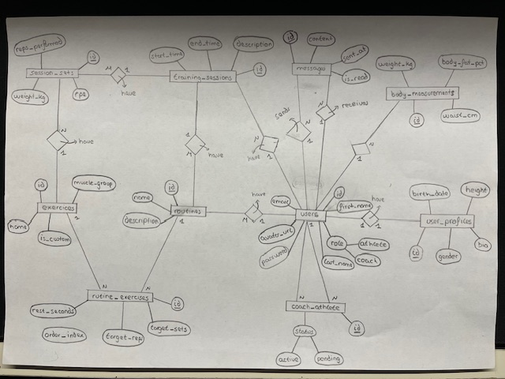

# BD y arquitectura (BD-A)

Estado: HECHO
Prioridad: Alta
Fecha: 29 de enero de 2026 → 11 de febrero de 2026

# RUTA DE SIGUIMIENTO:

- [x]  1. Definición de las reglas.
- [x]  2. Diseño e implementación de la Base de Datos.
    - [x]  2.1. Diseño conceptual (Modelo E-R), normalización y reglas de negocio.
        - [x]  Hacemos el modelado visual (el dibujo) y creamos el diagrama EER con todas las tablas definidas en el análisis. —> [Modelo de Datos (Diseño de la Base de Datos)](An%C3%A1lisis%20y%20definici%C3%B3n%20(A-D)%202ebe8f6ada4d80728a29c305bd923e3d.md).
        - [x]  Definimos las relaciones, establecemos las cardinalidades (1:N, N:M) y definimos las acciones en cascada (`ON DELETE CASCADE`) para mantener la integridad.
        
        NOTA: probar a hacer le esquema en workbench para que luego solo tener se tenga que exportar, generándose las tabla automáticamente.
        
        - [x]  Hacemos la normalización, y comprobamos que el modelo esté en Tercera Forma Normal (3FN) para evitar redundancias.
        - [x]  Creación del diccionario de datos.
            - [x]  Hacemos una documentación explicando el “porqué” de cada decisión técnica.
                - Tipado preciso: justificamos el uso de cada tipo. (ej: `DECIMAL(5,2)` para los pesos, `ENUM` para los roles).
                - Restricciones, anotando que campos son `UNIQUE` (como el email) o `NOT NULL`.
    - [x]  2.2. Configuración del Entorno de Desarrollo y Control de Versiones.
        - [x]  **I**nicialización del Proyecto: Creación de la estructura de carpetas local (`FYLIOS/`) y configuración inicial del repositorio.
            - [x]  Creación del repositorio en GitHub (TFG).
            - [x]  Creamos la carpeta en el escritorio (FYLIOS) y la abrimos en vsc.
        - [x]  Instalación de Docker y de MySQL Workbench o 8.0.
        - [x]  Infraestructura como Código (IaC): Creación del archivo `docker-compose.yml` en la raíz del proyecto para definir la arquitectura del servidor.
            - [x]  Orquestación: Configuración del servicio MySQL 8.0 de forma declarativa.
            - [x]  Red: Mapeo del puerto 3307 (Host) al 3306 (Container) para evitar conflictos con XAMPP.
            - [x]  Persistencia: Definición de volúmenes (`/mysql_data`) para asegurar que los datos sobrevivan al reinicio del contenedor.
        - [x]  Seguridad y Exclusiones: Creación del archivo `.gitignore` antes del primer commit para bloquear la subida de carpetas sensibles (`mysql_data/`) y archivos de configuración de entorno (`.env`).
        - [x]  Una vez configurados los archivos, inicializamos una serie de comandos en la terminal.
        - [x]  Despliegue del Servidor: Ejecución de `docker-compose up -d`. Esto descarga la imagen y crea automáticamente el servidor de base de datos aislado y listo para recibir conexiones. Además aparece una nueva carpeta `mysql_data` .
- [x]  3. Forward Engineering y Scripting SQL.
    - [x]  Conexión Profesional: Configuración de la conexión TCP/IP en MySQL Workbench apuntando al contenedor Docker.
    - [x]  Diseño del Esquema EER (Visual): Utilización de la herramienta de diseño visual de Workbench para "dibujar" el diagrama Entidad-Relación en lugar de escribir código SQL manual.
        - [x]  Creación gráfica de tablas y columnas.
        - [x]  Establecimiento visual de relaciones (1:N, N:M) y claves foráneas.
        - [x]  Configuración de disparadores de integridad referencial (`ON DELETE CASCADE`).
    - [x]  Generación de SQL (Forward Engineering): Uso de la función de "Ingeniería Directa" de Workbench para traducir el dibujo automáticamente a un script SQL robusto y ejecutarlo en el servidor Docker.
- [x]  4. Carga de Datos y Validación (Seeding & Testing).
    - [x]  Datos Semilla (Seeding): Inserción mediante script de datos maestros iniciales:
        - [x]  Catálogo base de ejercicios predefinidos.
        - [x]  Usuarios de prueba con diferentes roles (Entrenador y Atleta).
    - [x]  Pruebas de Integridad: Verificación manual de las restricciones:
        - [x]  Verificación de claves únicas (evitar emails duplicados).
        - [x]  Comprobar el borrado en cascada (ej: borrar un usuario y verificar que desaparecen sus rutinas).
        - [x]  Validar el funcionamiento de la nueva tabla de mensajes simulando una conversación.

## DEFINICIÓN DE LAS REGLAS:

1. Los nombres del las tablas, columnas y relaciones se definirán en **inglés**, ya que es el estándar universal en el desarrollo de software. Programando en inglés evitamos problemas con caracteres especiales del español como la ñ o las tildes, además facilita la integración con librerías externas.
2. Se usará estrictamente `snake_case`, el cual, consiste en escribir todo en minúscula separando las palabras con un guion bajo. Se empleará este formato, ya que es el mas compatible con los sistemas de gestión de bases de datos y los frameworks de backend.
3. El nombre de las tablas irán en **plural**, esto porque las tablas son una colección de registros, entonces siguiendo la lógica de los ORM modernos, la tabla se llama `users` y cada registro dentro es un objeto `User`.
4. En cada tabla deberá haber una **clave primaria (primary key)** única llamada simplemente id, esto simplifica las consultas y automatiza las configuraciones que se hacen en el backend. Se definirá como un entero largo autoincremental. (`BIGINT UNSIGNED AUTO_INCREMENT`).
5. Para las **claves foráneas (foreign keys)** se usará el formato **tabla_en_singular_id**, esto permite  identificar inmediatamente a que tabla hacer referencia un campo. Ejemplo: En la tabla `routines`, el campo que apunta al usuario será `user_id`.
6. Todas las tablas deben incluir los campos `created_at` y `updated_at`. Esto permitirá saber cuando se creó un registro y cuándo se modificó por última vez, algo esencial para el seguimiento deportivo y la seguridad.
7. Las tablas críticas incluirán el campo `deleted_at` (nulo por defecto). Esto ya lo expliqué que lo incluiría y es la opción de dar de baja registros, pero sin eliminarlos físicamente de la base de datos, manteniendo el progreso del usuario si se vuelve a registrar. 

Estas reglas sirven para asegurar la interoperabilidad con el framework de desarrollo y para tener “Buenas Prácticas” a la hora de desarrollar la ingeniería de software  actual, facilitando asi, el mantenimiento y la escalabilidad del sistema.

## DISEÑO E IMPLEMENTACIÓN DE LA BASE DE DATOS

### DISEÑO CONCEPTUAL (MODELO E-R), NORMALIZACIÓN Y REGLAS DE NEGOCIO:

Modelo entidad-relación:



Normalización: 

El diseño del modelo de datos se ha sometido a un proceso de normalización hasta alcanzar la **Tercera Forma Normal (3FN)**. Se ha verificado la atomicidad de los atributos (1FN), se han eliminado dependencias parciales asegurando que cada atributo dependa de su clave primaria (2FN) y se han eliminado dependencias transitivas (3FN) para evitar la redundancia de información y garantizar la integridad referencial del sistema.

Diccionario de datos:

Bloque 1: Identidad

| TABLA | CAMPO | TIPO DE DATO | RESTRICCIONES | DESCRIPCIÓN |
| --- | --- | --- | --- | --- |
| users | id | bigint | pk, ai, unsigned | Identificador único |
|  | first_name | varchar(50) | not null | Nombre visible del usuario |
|  | last_name | varchar(50) | not null | Apellido visible del usuario |
|  | email | varchar(255) | unique, not null | Correo electrónico de acceso. |
|  | password | varchar(255) | not null | Hash de la contraseña. |
|  | role | enum | ‘coach’
’athlete’ | Rol del usuario en el sistema. |
|  | avatar_url | varchar(2048) | null | Enlace a la foto de perfil. |
| user_profiles | id | bigint | pk, ai, unsigned | Identificador único |
|  | user_id | bigint | fk, unique, null | Relación 1:1 con la tabla users |
|  | birth_date | date | null | Fecha de nacimiento del atleta. |
|  | height | int | null | Altura en centímetros (ej: 180.50). |
|  | gender | enum | ‘M’, ‘F’, ‘Other’ | Género del usuario. |
|  | bio | text | null | Biografía (útil para perfiles de Coach). |
| coach_athlete | id | bigint | pk, ai, unsigned | Identificador único de la relación |
|  | coach_id | bigint | fk, not null | ID del usuario con rol Coach. |
|  | athlete_id | bigint | fk, not null | ID del usuario con rol Athlete. |
|  | status | enum | ‘pending’
’active’ | Estado de la vinculación. |
| messages | id | bigint | pk, auto_increment | Identificador único del mensaje. |
|  | sender_id | bigint | fk, not null | ID del usuario que envía el mensaje. |
|  | receiver_id | bigint | fk, not null | ID del usuario destinatario. |
|  | content | text | not null | Cuerpo del mensaje.  |
|  | is_read | boolean | default false (0) | Indicador de estado. 0 = No leído (activa notificación), 1 = Leído. |
|  | sent_at | datetime | default current_timestamp | Fecha y hora exacta del envío.  |

Bloque 2: Entrenamiento

| TABLA | CAMPO | TIPO DE DATO | RESTRICCIONES | DESCRIPCIÓN |
| --- | --- | --- | --- | --- |
| exercises | id | bigint | pk, ai, unsigned | Identificador único |
|  | name | varchar(255) | not null | Nombre del ejercicio (ej: Squat). |
|  | muscle_group | varchar(100) | not null | Grupo muscular principal. |
|  | is_custom | boolean | default false | Si es un ejercicio creado por usuario. |
| routines | id | bigint | pk, ai, unsigned | Identificador único |
|  | user_id | bigint | fk, not null | Creador/Dueño de la rutina. |
|  | name | varchar(255) | not null | Título (ej: Torso-Pierna). |
|  | description | text | null | Notas sobre el plan. |
| routine_exercises | id | bigint | pk, ai, unsigned | Identificador de la línea de rutina. |
|  | routine_id | bigint | fk, not null | Rutina a la que pertenece. |
|  | exercise_id | bigint | fk, not null | Ejercicio a realizar. |
|  | order_index | int | not null, default 0 | Define el orden de ejecución |
|  | target_sets | int | not null | Series objetivo. |
|  | target_reps | varchar(50) | not null | Repeticiones (ej: "8-12" o "Fallo"). |
|  | rest_seconds | int | default 90 | Segundos de descanso |

Bloque 3: Progreso

| TABLA | CAMPO | TIPO DE DATO | RESTRICCIONES | DESCRIPCIÓN |
| --- | --- | --- | --- | --- |
| training_sessions | id | bigint | pk, ai, unsigned | Identificador de la sesión. |
|  | user_id | bigint | fk, not null | Atleta que entrena. |
|  | routine_id | bigint | fk, null | Rutina opcional que se ha seguido. |
|  | start_time | datetime | not null | Fecha y hora de inicio. |
|  | end_time | datetime | null | Fecha y hora de finalización. |
|  | description | text | null | Feedback del entrenador. |
| session_sets | id | bigint | pk, ai, unsigned | Identificador de la serie. |
|  | session_id | bigint | fk, not null | Sesión a la que pertenece. |
|  | exercise_id | bigint | fk, not null | Ejercicio realizado. |
|  | weight_kg | decimal(5,2) |  not null | Carga levantada en esta serie. |
|  | reps_performed | int | not null | Repeticiones logradas. |
|  | rpe | int | null | Esfuerzo percibido (1-10). |
| body_measurements | id | bigint | pk, ai, unsigned | Identificador del registro. |
|  | user_id | bigint | fk, not null | Usuario al que pertenecen los datos. |
|  | weight_kg | decimal(5,2) |  not null | Peso corporal actual. |
|  | waist_cm | decimal(5,2) | null | Medida de cintura. |
|  | body_fat_pct | decimal(4,2) | null | % de grasa corporal. |

A todas estas tablas les añadiremos en el siguiente paso (Workbench) los campos **`created_at`** y **`updated_at`** de tipo **`TIMESTAMP`**, ya que son estándar de la industria para saber cuándo se creó o editó cada dato.

### CONFIGURACIÓN DEL ENTORNO DE DESARROLLO Y CONTROL DE VERSIONES:

En esta fase se han sentado las bases de la arquitectura del proyecto FYLIOS, priorizando la portabilidad (que funcione en cualquier ordenador) y la seguridad del código. A continuación, se detallan las decisiones técnicas implementadas:

Lo primero que se ha hecho ha sido crear una carpeta local que conforma la estructura del proyecto, además, se ha inicializado un repositorio Git siguiendo el flujo de trabajo estándar (`git flow` básico) para asegurar la trazabilidad de los cambios.

En la configuración del repositorio, este lo he puesto público, sin marcar la casilla de “Add README” ni “.gitignore”, de momento. Y una vez creado he copiado el enlace que me daba.

Para la gestión del servidor de la base de datos se ha optado por la virtualización mediante Docker, ya que permite aislar el servicio de MySQL del sistema operativo anfitrión, evitando conflicto de versiones, además de replicar la infraestructura del proyecto en cualquier máquina con un solo comando, asegurando la consistencia entre los entornos de desarrollo y producción.

Una instalado Docker y configurado tanto el repositorio como las carpetas locales he empezado creando los archivos: `docker-compose.yml` , `.gitignore` y `database.sql` .

- `docker-compose.yml` —> Orquestación Declarativa: mediante este archivo hemos definido el estado deseado del servidor. Esto elimina el clásico problema de *"en mi local funciona"*, ya que el entorno es idéntico para cualquier desarrollador.
    
    Además, se ha reconfigurado los puertos, desviando el tráfico del puerto `3307` del ordenador anfitrión al puerto estándar `3306` del contenedor.
    
    - Justificación: Esto permite que el proyecto `FYLIOS` coexista sin conflictos con otras bases de datos locales (como XAMPP o MariaDB) que ya ocupan el puerto 3306.
    
    Finalmente se ha implementado un volumen vinculado (*Bind Mount*) que enlaza la carpeta interna del contenedor `/var/lib/mysql` con la carpeta local `./mysql_data`.
    
    - *Resultado:* Al ejecutar el contenedor, se ha generado automáticamente la carpeta `mysql_data` en el escritorio. Esto garantiza que, si borramos o reiniciamos el contenedor, la información de los usuarios y entrenamientos **no se pierda**.
    
    ```yaml
    version: '3.8'
    
    services:
      db:
        image: mysql:8.0
        container_name: fylios_db
        restart: always
        environment:
          MYSQL_ROOT_PASSWORD: root
          MYSQL_DATABASE: fylios
        ports:
          - "3307:3306"
        volumes:
          - ./mysql_data:/var/lib/mysql
    ```
    
- `.gitignore` —> Gestión de Exclusiones: Antes del primer *commit*, se configuró este archivo para ignorar la carpeta `mysql_data/`.
    - *Justificación de Seguridad:* Nunca se deben subir bases de datos binarias ni archivos pesados al repositorio remoto. Git solo debe gestionar código fuente, no datos de usuario.
    
    Se ha conectado el entorno local con el repositorio remoto en GitHub (`origin`), estableciendo la rama `main` como la fuente de la verdad para el despliegue.
    
- `database.sql` —>

Acabado de configurar los diferente archivos, se ha ejecutado los siguientes comandos para conectar el proyecto con GitHub:

- `git init` para iniciar git en la carpeta del proyecto
- `git add .` preparar los archivos a subir
- `git commit -m "Estructura inicial del proyecto con Docker”`  Guardar la versión (Commit)
- `git branch -M main` Cambiar la rama a 'main' (estándar moderno):
- `git remote add origin url del repositorio` Conectar con tu GitHub
- `git push -u origin main` Subir los archivos

Finalmente mediante el comando `docker-compose up -d`, se ha ejecutado el contenedor en modo "demonio" (segundo plano). Docker ha descargado la imagen oficial de MySQL 8.0 y ha levantado el servicio, dejándolo listo para recibir conexiones entrantes a través del puerto 3307.

## FORWAR ENGINEERING Y SCRIPTING SQL:

Finalmente, en lugar de escribir el código SQL manualmente —proceso propenso a errores sintácticos—, se utilizó la funcionalidad de Forward Engineering de MySQL Workbench.

El proceso siguió estos pasos:

1. Despliegue: El script se ejecutó exitosamente contra el contenedor Docker en el puerto 3307.
2. Generación del Script SQL: La herramienta tradujo el diagrama visual a un script de creación de tablas (**`CREATE TABLE IF NOT EXISTS...`**).
3. Limpieza de Entorno: Se habilitó la opción **`*DROP Objects Before Each CREATE*`** para asegurar que la base de datos se regenerara desde cero, eliminando cualquier residuo de pruebas anteriores.

Resultado: La base de datos **`fylios`** ha sido creada correctamente con las 9 tablas operativas y listas para la inserción de datos, verificándose su existencia mediante el inspector de esquemas de Workbench.

## CARGA DE DATOS Y VALIDACIÓN (SEEDING & TESTING):

Datos Semilla (carga de datos):

Para finalizar la puesta en marcha de la capa de persistencia, se realizó la carga de datos semilla (seeding) y se ejecutaron pruebas de estrés para verificar la robustez de las restricciones relacionales.

Se generó un script SQL de inserción masiva para dotar al sistema de una configuración inicial funcional, esencial para las etapas posteriores de desarrollo del Backend. 

- Se insertaron 8 ejercicios fundamentales con su respectivos grupos musculares, estableciendo una biblioteca base para que los nuevos usuarios puedan crear rutinas desde el primer momento.
- También se crearon dos perfiles con roles diferenciados (COACH y ATHLETE) para simular la interacción real entre entrenador y cliente.

Pruebas de Integridad (validación):

Se ha sometido a la base de datos a una prueba de validación de claves foráneas (*Foreign Key Constraints*) para asegurar la consistencia de los datos.

El caso de prueba que se llevo a cabo, fue el intento de eliminación de un usuario, el cual posee dependencias activas.

1. Le asigné una rutina de prueba a un usuario activo.
2. Para, posteriormente borrar al atleta con la sentencia **`delete`** 

El resultado fue que el SGBD (MySQL) bloqueó la operación devolviendo el error previsto **#1451 (Cannot delete or update a parent row),** confirmando que el esquema relacional protege correctamente la información, impidiendo un posible borrado accidental de registros maestros (Usuarios) mientras existan registros dependientes como rutinas sesiones o medidas, dependiendo de ellos, garantizando asi la integridad referencial del sistema.

Pruebas de simulacro de Conversación (Tabla Messages):

Se ha sometido a esta prueba para verificar que tanto la clave foránea `sender_id` como la clave `receiver_id` funcionan y conectan usuarios reales.

El caso de prueba fue intentar conectar a dos usuarios: el entrenado y el atleta

1. Cree los dos usuarios y capture sus IDs, para poder identificarlos.
2. Luego, creé una simulación de chat donde uno de los usuarios (el coach) escribe a otro (el atleta).

El resultado fue una tabla de mensajes con dos filas, y todas con sus columnas, todo correctamente.